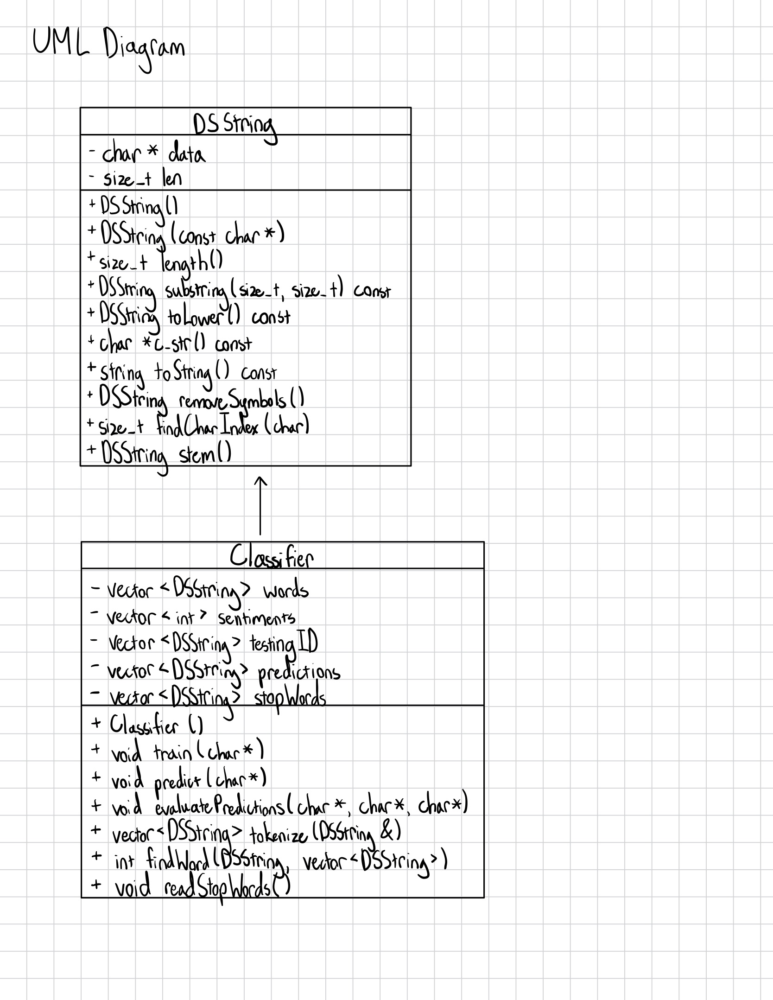

# Assignment 2: Answers

**Complete this document, commit your changes to Github and submit the repository URL to Canvas.** Keep your answers short and precise.

Your Name: Bonita Davis

Used free extension: [ ] 24 hrs or [ ] 48 hrs

[x] Early submission (48 hrs) (I only added timing after.)

[x] Bonus work. Describe: Although I did not reach a 72% accuracy, I would like to know if I could get partial bonus points for my 68.2% accuracy. I used a stemming library, a list of stop words, removed non-characters, and made all words lowercase.

Place [x] for what applies.

## UML Diagram

Add your UML class diagram here.

Replace the following image with your diagram. You can draw it by hand and take a photo.

## Answers

1. How do you train the model and how do you classify a new tweet? Give a short description of the main steps.

    > To train the model, you should first read each line of the input file into a DSString and store the sentiment value in a boolean variable and the tweet in a DSString variable. Then, you should clean the tweet by making it lowercase, removing non-letters from it, and stemming. Then, you should tokenize the tweet and store the tokens in a vector. Then, you should iterate through the tokens and add new words to the words vector. Increment or decrement the word's sentiment value based on whether the sentiment of the tweet is positive or negative. To predict the classification of a new tweet, first, you should read each line of the input file and store each testing ID in a vector and each tweet in a DSString variable. Next, you should clean the tweet by making it lowercase, removing non-letters from it, and stemming. Then, you can predict the sentiment values of each tweet by iterating through the words in each tweet, finding those words in the vector of training words, and using the sentiment value assigned while training.

2. How long did your code take for training and what is the time complexity of your training implementation (Big-Oh notation)? Remember that training includes reading the tweets, breaking it into words, counting, ... Explain why you get this complexity (e.g., what does `N` stand for and how do your data structures/algorithms affect the complexity).

   > My code took 363 seconds for training. The time complexity of my training implementation is O(xyz) with x = number of lines in the input file, y = number of words in tweet, and z = number of total words because the program checks every word in the files with every word in the vector. My training algorithm has a for loop that iterates through the number of total words nested inside a for loop that iterates through the number of words in tweet nested inside a while loop that iterates through the number of lines in the input file.

3. How long did your code take for classification and what is the time complexity of your classification implementation (Big-Oh notation)? Explain why.

   > My code took 402 seconds for classification. The testing and classification algorithms have the same run time complexity of O(xyz) with x = number of lines in the input file, y = number of words in tweet, and z = number of total words because the program checks every word in the files with every word in the vector. My testing algorithm has a for loop that iterates through the number of total words nested inside a for loop that iterates through the number of words in tweet nested inside a while loop that iterates through the number of lines in the input file.

4. What accuracy did your algorithm achieve on the provides training and test data? 

   > My accuracy: 68.2%

   The TA will run your code on Linux and that accuracy value will be used to determine your grade.

5. What were the changes that you made that improved the accuracy the most?
   
   > Removing characters that are not letters from each tweet improved the accuracy the most because before implementing this, a word with a symbol after the word would be analyzed as a separate word.

6. How do you know that you use proper memory management? I.e., how do you know that you do not have
   a memory leak?

   > I know that I have used proper memory management because I ran all my executable files on Valgrind, and Valgrind did not detect any memory leaks or errors.

6. What was the most challenging part of the assignment?

   > The most challenging part of this assignment was getting started and figuring out how to fix memory leaks. Before this assignment, I had only coded smaller assignments, so I did not know how to begin creating a custom string class or how to begin creating an algorithm that analyzes the sentiment values of a large data set. I also had never checked my code for memory leaks or used Valgrind before this assignment, so it was challenging to figure out how to use Valgrind and how to use the results from Valgrind to find memory leaks.
